# Create the environment

1. [Create Ubuntu VM from the .iso image](https://ubuntu.com/tutorials/how-to-run-ubuntu-desktop-on-a-virtual-machine-using-virtualbox#1-overview)

   - Please Skip Unattended Installation, otherwise your user cannot get root
     privilege

   - [optional] "Guest addition" in VBox can help to use full screen,
     copy/paste and share
     files with the host, you can install it based on
     ["Installing the Linux Guest Additions"](https://www.virtualbox.org/manual/ch04.html#additions-linux) and ["Setting up VirtualBox Guest Additions"](https://help.ubuntu.com/community/VirtualBox/GuestAdditions)

<p align="center">
  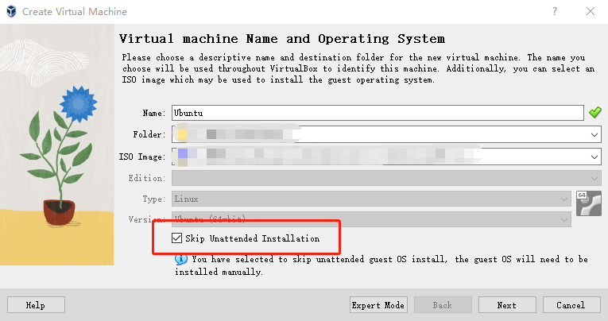
</p>

2. [Install VS Code](https://code.visualstudio.com/download)
3. Remember to install python3-venv, otherwise the PlatformIO cannot run

```shell
sudo apt-get install git
sudo apt-get install python3-venv
```

4. [Install PlatformIO IDE for VSCode](https://platformio.org/install/ide?install=vscode)
5. Add the user _IoT_ into the group dialout so that _IoT_ can use ttyusb0
   - [Permission denied: '/dev/ttyUSB0](https://askubuntu.com/questions/133235/how-do-i-allow-non-root-access-to-ttyusb0)

```
sudo usermod -a -G dialout $USER
```

5. For ease of transferring files out of Ubuntu VM to the host computer, a [shared folder](https://net2.com/how-to-share-folders-between-your-ubuntu-virtualbox-and-your-host-machine/) can be created.

# Programming

There are at least four options of programming for ESP32: VS Code + PlatformIO, VS Code + ESP-IDF, Native ESP-IDF programming environment, and Arduino IDE. Arduino IDE is easy to use, but with limited functionalities such as debugging. VS Code + ESP-IDF and the native ESP-IDF programming environment are essentionally the same while VS Code + ESP-IDF provides a GUI interface and a user does not need to remember various ESP-IDF commands. VS Code + PlatformIO supports both Arduino framework and ESP-IDF programming framework. An Arduino ESP32 project can be imported into VS Code + PlatformIO. The ESP-IDF fromawork under VS Code + PlatformIO is smililar to VS Code + ESP-IDF and naive ESP-IDF programming environment, but their configugration grammars are different. We use VS Code + PlatformIO, Native ESP-IDF programming environment and Arduino IDE.

## VSCode + PlatformIO

The detailed installation of VSCode and PlatformIO can be found in
["PlatformIO IDE for VSCode"](https://docs.platformio.org/en/latest/integration/ide/vscode.html#installation) and [Get started with ESP-IDF and ESP32-DevKitC: debugging, unit testing, project analysis](https://docs.platformio.org/en/stable/tutorials/espressif32/espidf_debugging_unit_testing_analysis.html). To set up the project:

1. Click on "PlatformIO" Logo on the side to launch PlatformIO,

<p align="center">
  
</p>

2. Click on “PlatformIO Home” button on the bottom [PlatformIO Toolbar](https://docs.platformio.org/en/latest/integration/ide/vscode.html#ide-vscode-toolbar)

<p align="center">
  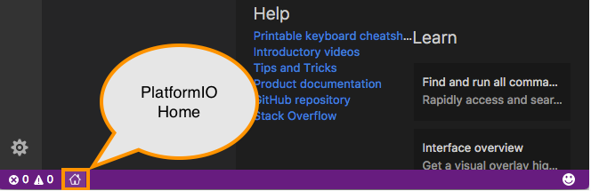
</p>

3. Click on “New Project”, select `Espressif ESP32 Dev Module` as the development board, `Espressif IoT Development Framework` or `Arduino` as the framework (based on project) and a path to the project location (or use the default one):
<p align="center">
  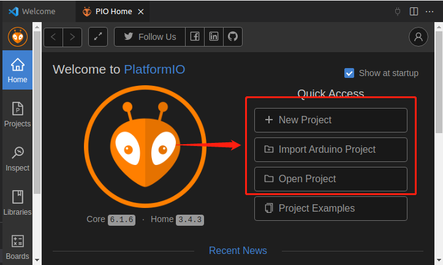
</p>

<p align="center">
  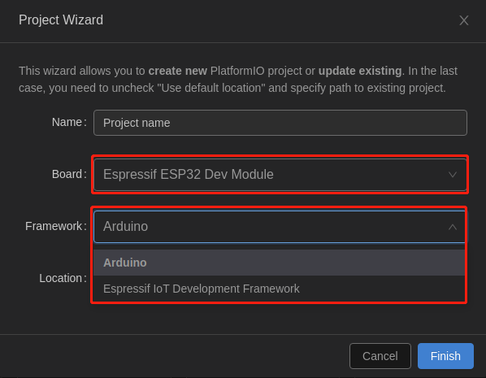
</p>

4. After the project is created, you need to wait until the the dependecies are
   downloaded and updated.

<p align="center">
  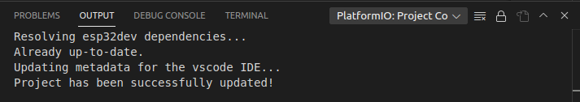
</p>

5. Change the platform espressif32 version in `platformio.ini`
```
platform = espressif32@4.4.0
```

<p align="center">
  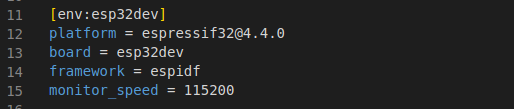
</p>


6. To compile the project use one of the following options:

    - Build option from the `Project Tasks` menu

    - Build button in [PlatformIO
  Toolbar](https://docs.platformio.org/en/stable/integration/ide/vscode.html#ide-vscode-toolbar)

    - Task Menu `Tasks: Run Task... > PlatformIO: Build` or in [PlatformIO
  Toolbar](https://docs.platformio.org/en/stable/integration/ide/vscode.html#ide-vscode-toolbar)

    - Command Palette `View: Command Palette > PlatformIO: Build`

    - Hotkeys `cmd-alt-b / ctrl-alt-b`

<p align="center">
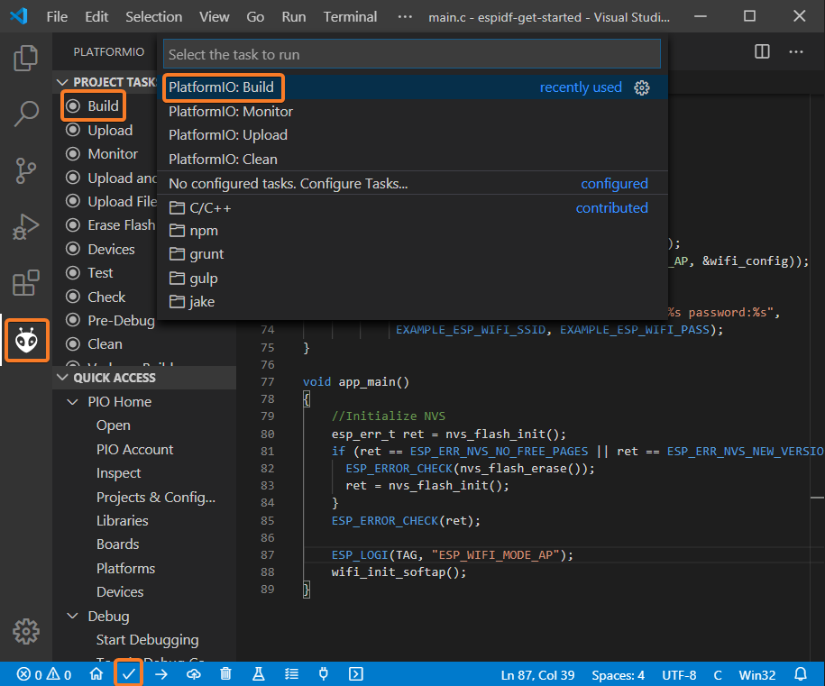
</p>

7. To upload the firmware to the board we can use the following options:

    - Upload option from the `Project Tasks` menu

    - Upload button in [PlatformIO
      Toolbar](https://docs.platformio.org/en/stable/integration/ide/vscode.html#ide-vscode-toolbar)

    - Command Palette `View: Command Palette > PlatformIO: Upload`

    - Task Menu `Tasks: Run Task... > PlatformIO: Upload`

    - Hotkeys `cmd-alt-u / ctrl-alt-u`

<p align="center">

</p>

8. Open Serial Monitor to observe the output from the board

<p align="center">
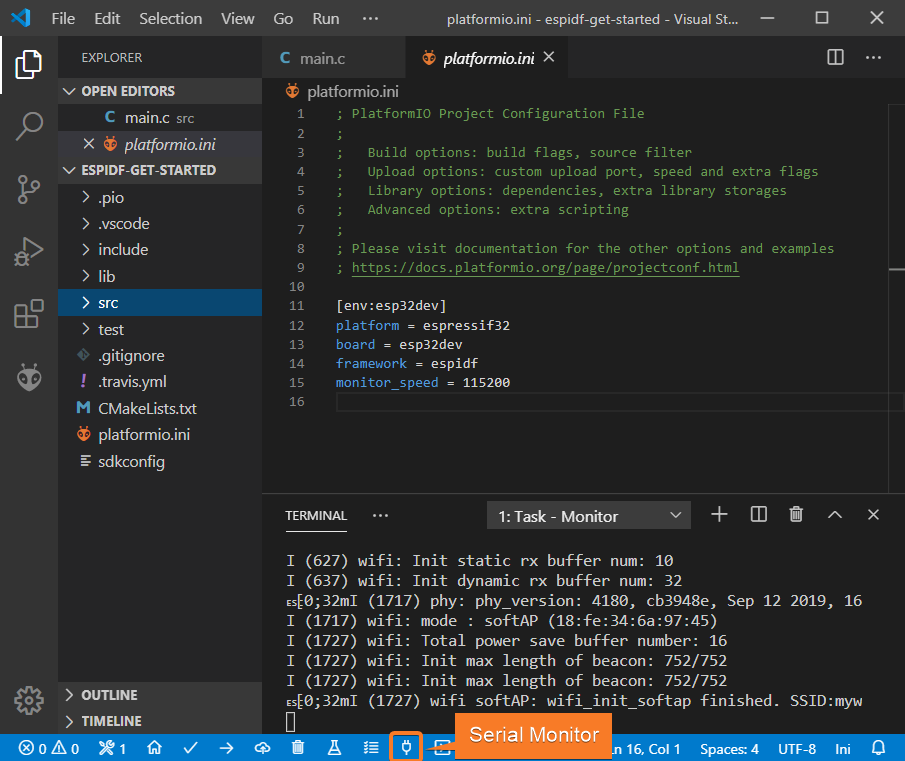
</p>

9. To start the debug session we can use the following methods:
    - `Debug: Start debugging` in the top menu

    - `Start Debugging` option in the Quick Access menu

    - Hotkey button `F5`:

<p align="center">
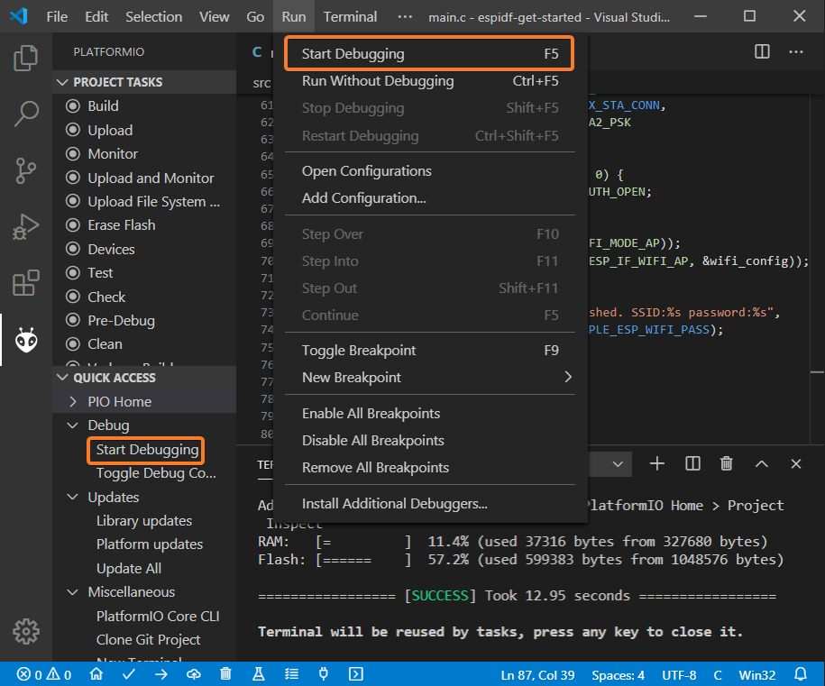
</p>

10. Walk through the code using control buttons, set breakpoints, and add
    variables to the `Watch window`

<p align="center">
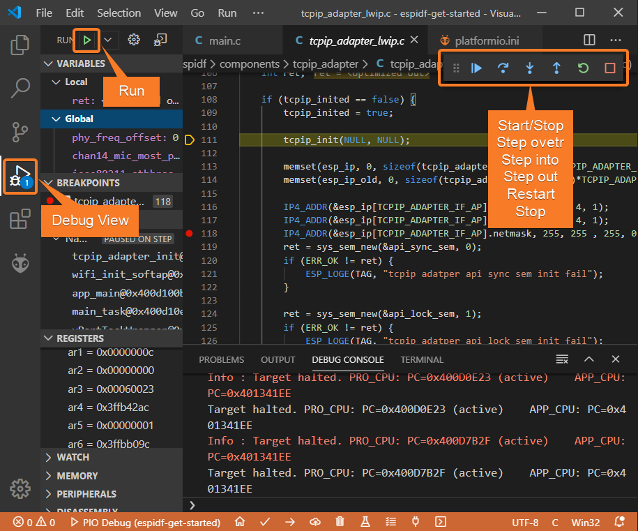
</p>


### PlatformIO--ESP-IDF framework

This is a great tutorial on using [PlatformIO with VS Code](https://docs.platformio.org/en/latest/platforms/espressif32.html#tutorials).

1. Clone [ESP-IDF Components library](https://github.com/UncleRus/esp-idf-lib), ESP-IDF-LIB will be downloaded into `~/esp-idf-lib`
```
cd ~ && git clone https://github.com/UncleRus/esp-idf-lib.git
```

2. Use ESP-IDF on PlatformIO: [Espressif IoT Development Framework under PlatformIO](https://docs.platformio.org/en/latest/frameworks/espidf.html#examples), using EXTRA_COMPONENT_DIRS option in the root CMakeLists.txt file

```
list(APPEND EXTRA_COMPONENT_DIRS ~/esp-idf-lib/components)
```

3. [Get started with ESP-IDF and ESP32-DevKitC: debugging, unit testing, project analysis](https://docs.platformio.org/en/stable/tutorials/espressif32/espidf_debugging_unit_testing_analysis.html)
   - Note: follow the steps. Otherwise, errors such as monitor speed rate may happen
   - [pio\libdeps\esp32dev\DHT sensor library\DHT_U.h:36:29: fatal error: Adafruit_Sensor.h: No such file or directory](https://community.platformio.org/t/pio-libdeps-esp32dev-dht-sensor-library-dht-u-h29-fatal-error-adafruit-sensor-h-no-such-file-or-directory/21861)
     - The solution is simple. Add the following include statements to main.cpp:

        ```
        #include <Adafruit_Sensor.h>
        ```

4. Build, Upload and Debug are explained above


## Native ESP-IDF programming environment

[Standard Toolchain Setup for Linux and macOS](https://docs.espressif.com/projects/esp-idf/en/stable/esp32/get-started/linux-macos-setup.html) gives a guid to install ESP-IDF. We extract the key steps as below. We need to install essential dependecies and git clone the ESP-IDF version 4.3 in $HOME folder, install and set up the environment variables.

1. Install Prerequisites

```
sudo apt-get install git wget flex bison gperf python3 python3-venv python3-pip cmake ninja-build ccache libffi-dev libssl-dev dfu-util libusb-1.0-0 
```

2. Get ESP-IDF version 4.3, ESP-IDF will be downloaded into `~/esp-idf`
```shell
cd ~ && git clone -b v4.3 --recursive https://github.com/espressif/esp-idf.git
```

3. Set up the tools
```
cd ~/esp-idf && pip3 install virtualenv && ./install.sh esp32
```

4. Set up the environment variables
```
. ~/esp-idf/export.sh
```
5. Create an alias for executing export.sh, you can run `get_idf` to refresh
   the esp-idf environment in any terminal session

    - Copy and paste the following command to your shell’s profile `~/.bashrc`

        ```
        alias get_idf='. ~/esp-idf/export.sh'
        ```

    - Update `~.bashrc`

        ```
        source ~/.bashrc
        ```
 
## Troubleshooting

- If you can't change to the root user in VBox, or if it says "xxx is not in the sudoers file. This incident will be reported," try `su root`, the password is the same password you set during the installation
- If the VBox screen turns black and you cannot wake it up, you can choose from the menu: `View -> Virtual Screen 1 -> Resize to **_ x _**` (choose one you
  like), and then VBox will wake up
- If you encounter the error message, "The Python interpreter is not compatible. Reason: Could not find distutils module at ...," please run
  ```shell
  sudo apt-get install python3-venv
  ```


<p align="center">
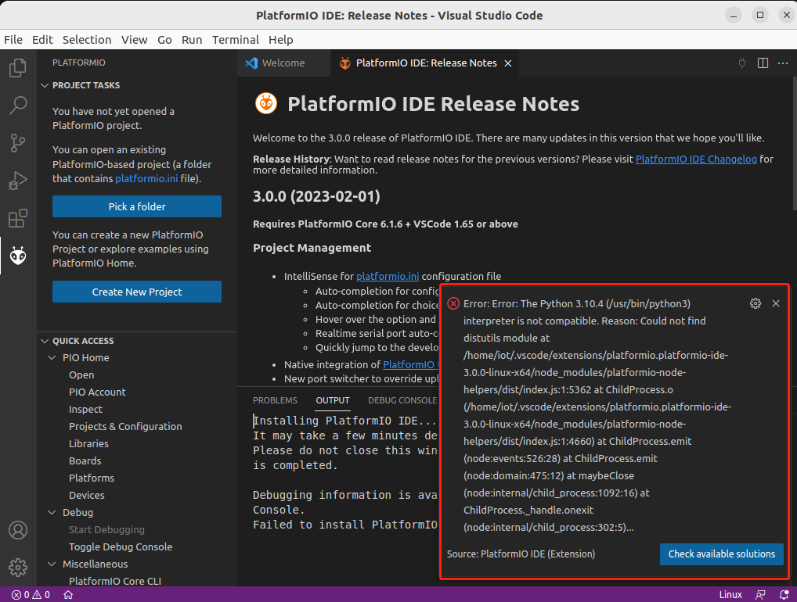
</p>


- Use a correct micro USB cable that supports both data transfer and power supply, like the typical smartphone micro USB cable
- Use a correct USB-serial device such as /dev/ttyUSB0, can use `ls /dev/ttyUSB0` to test if the device connected
- During connecting to /dev/ttyUSB0, may need to **hold the BOOT (IO0) button of the ESP32 until uploading starts**
- Press reset if no output from the serial port
- If still errors, unplug and re-plug the kit
- If still errors, change a USB port since different USB ports may provide different power supplies


# Reference
[IoT Security Hands-on Laboratory](https://cyber.cs.ucf.edu/iot/)

[PlatformIO IDE for VSCode](https://docs.platformio.org/en/latest/integration/ide/vscode.html)

[Get started with ESP-IDF and ESP32-DevKitC: debugging, unit testing, project analysis](https://docs.platformio.org/en/stable/tutorials/espressif32/espidf_debugging_unit_testing_analysis.html)

[Standard Toolchain Setup for Linux and
macOS](https://docs.espressif.com/projects/esp-idf/en/stable/esp32/get-started/linux-macos-setup.html)
