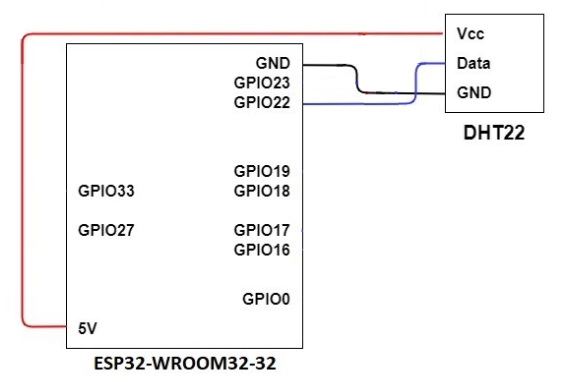
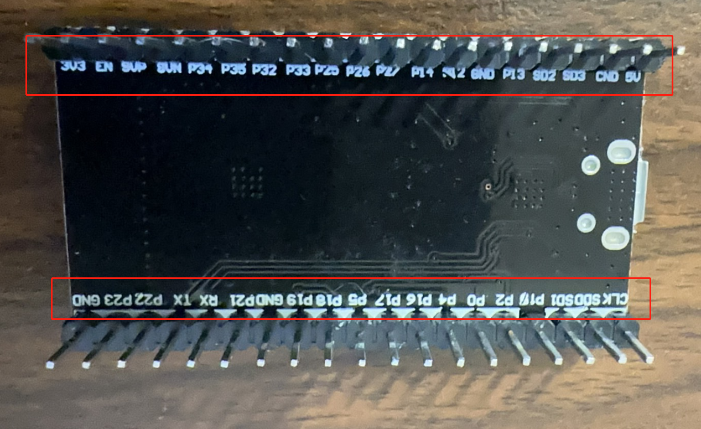
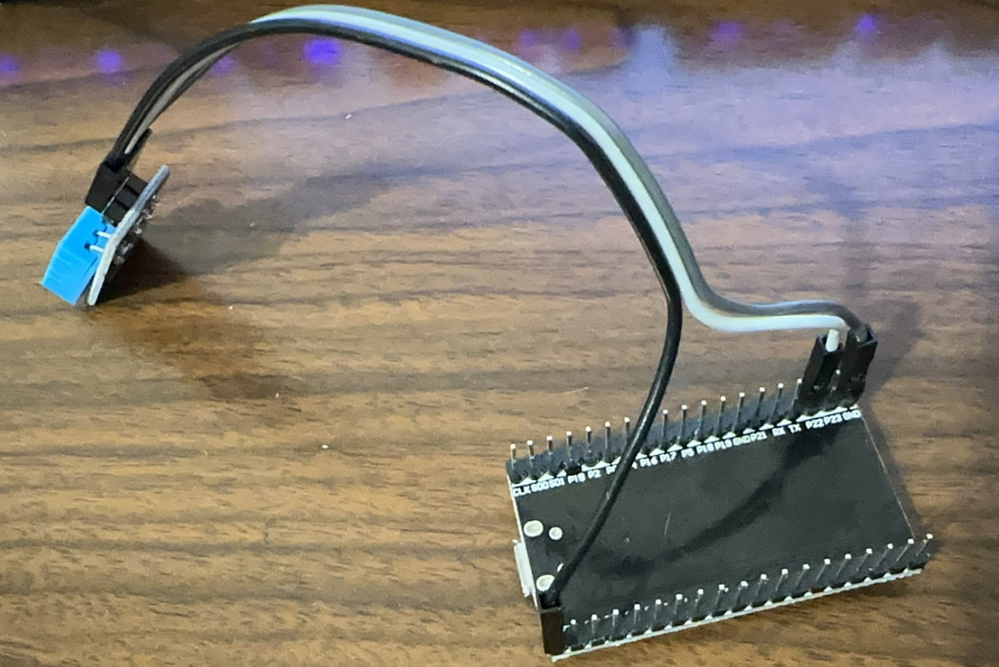
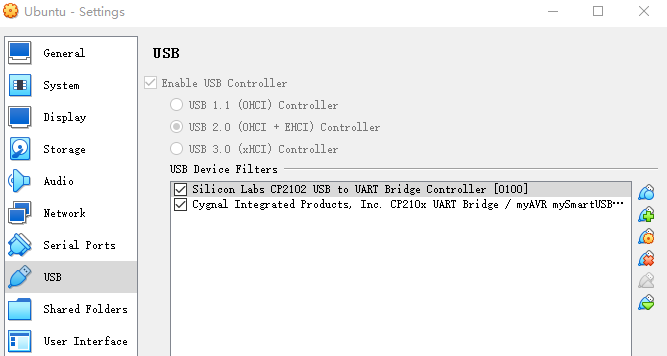
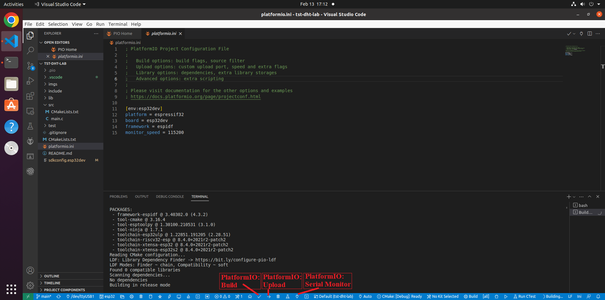
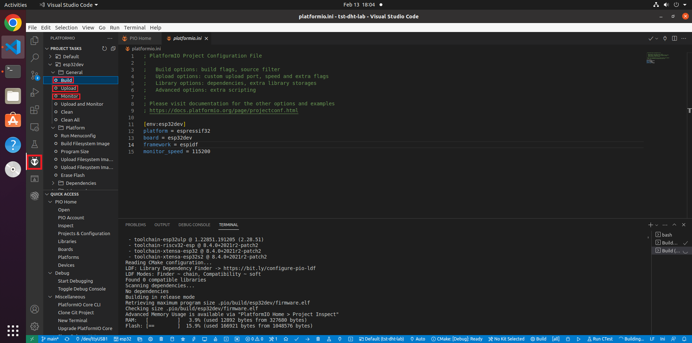

# Lab1: Get started with ESP32 via VS Code and PlatformIO

This project jumps start the use of ESP32 and programming environment. An ESP32 development board is used to read the DHT22 humidity and temperature sensor using a [third party sensor library---esp-idf-lib](https://github.com/UncleRus/esp-idf-lib), which has been installed at ~/esp-idf-lib in our Ubuntu VM.

The hard part is to install the CP210x USB to UART Bridge VCP Drivers and make it work.

## Set up the IoT kit

The diagram below shows how the DHT22 temperature and humidity sensor is connected to the ESP32:

  

The pins layout are on the back of the ESP32 chip:

  

The picture below gives a closer look at the connections of the IoT kit:

  

## Install the CP210x USB to UART Bridge VCP Driver

1. **Note**: Don’t start the Ubuntu VM yet, you should install the USB driver
   and connect the ESP32 first, only after this you can start the Ubuntu VM.

2. Connect the ESP32 board to your computer via a micro USB cable.

3. Install the USB to UART bridge driver on the host computer, which will run the guest Ubuntu VM. 
    - **Windows host**: Install [*the CP210x USB to UART Bridge VCP Drivers*](https://www.silabs.com/developers/usb-to-uart-bridge-vcp-drivers?tab=downloads) (CP210x Universal Windows Driver) for Windows. After installation, under *Ports* within the *Windows Device Manager*, you shall see *Silicon Labs CP210x USB to UART Bridge* (*COMx*), where *x* may be different at different computers.
    - **macOS host**: It appears macOS has the appropriate driver installed already. When the IoT kit is plugged in a USB port of a Mac computer, within Terminal, run ls /dev/*. /dev/cu.usbserial-0001 or similar shall be seen. When unplugged, the device disappears. 
      - If there is no /dev/cu.usbserial-0001, please download and install [CP210x USB to UART Bridge VCP Drivers](https://www.silabs.com/developers/usb-to-uart-bridge-vcp-drivers) (CP210x VCP Mac OSX Driver). 
      - Unzip the downloaded zip file. In the created macOS_VCP_Driver folder, run SiLabsUSBDriverDisk.dmg and then Install CP210x VCP Driver.app. After successful installation, within Terminal, run ls /dev/*. /dev/cu.SLAB_USBtoUART shall show up.

4. After log into the Ubuntu VM, within *Terminal*, run `ls /dev/ttyUSB0` to see ttyUSB0, when the mcro-usb cable of the IoT kit is unplugged from your host computer, ttyUSB0 disappears. 

5. If you cannot find the /dev/ttyUSB0 but you can find it in *Windows Device Manager*,
   that means you don't connect the USB to VBox successfully, you need to go to
   `Devices -> USB -> USB settings`, add `Silicon Labs CP2102 USB` to the `USB
   Device Filters`, then turn off the VBox, restart the Ubuntu again.

  

**Note**: It appears that the CP210x USB to UART Bridge VCP Driver has quite some issues. Here are troubleshooting tips
- Make sure the correct micro usb cable is used. The micro usb is like the one used for phones for both data communication and power supply.
- Try different USB ports on the computer and see which one works. 
- Sometimes, unplug and plug again the micro usb cable will address the issue.

## Build, Upload and Test

1. Start Visual Studio Code. Open *File* -> *Open Folder*. 
2. Click the *PlatformIO: Build* icon on the status bar at the bottom of the VS Code interface to build the project. 
   - Refer to the picture below
   - If the icon does not work, use the alternative apporach at the end of this post
4. Click the *PlatformIO: Upload* to upload the firmware onto the ESP32 board. 
   - **Note**: During the uploading process, you may need to **hold down the boot button until the uploading starts**, BOOT (IO0) button is on the right side(Chip on the top side) of ESP32

   - Refer to the picture below
   - If the icon does not work, use the alternative apporach at the end of this post

  

5. Click the *PlatformIO: Serial Monitor* icon to open the Serial Monitor to see the output from the ESP32 board. 
   - Refer to the picture below
   - If the icon does not work, use the alternative apporach at the end of this post

**Alternatively**, Build, Upload and Monitor can be done by clicking on the PlatformIO icon and use Build, Upload and Monitor within PROJECT TASKS as shown below

  

# Reference

[ESP32 via VS Code and PlatformIO](https://github.com/xinwenfu/tst-dht-lab)
