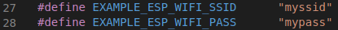
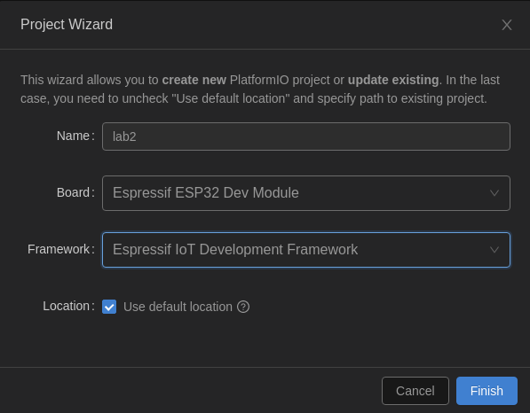
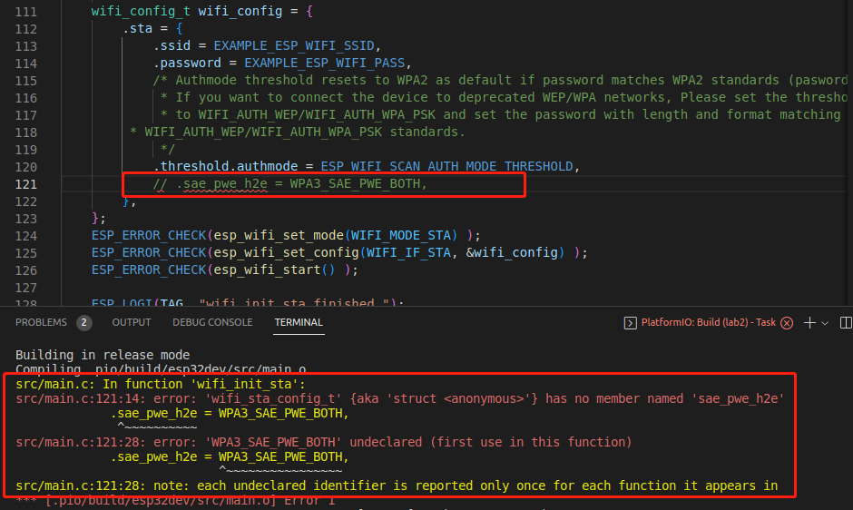

# Lab2: ESP32 UART and Flash Hack 

There are three serial ports on the original ESP32. UART0 is often used for programming and communication with outside of ESP32 while the other two UART ports are unused. The Micro-USB connector of our IoT kit is connected to UART0 through a USB-UART bridge chip. If there is no protection of UART, a hacker can access the flash through UART. The access to UART can be protected by a password. That is, a user must enter the correct password to upload firmware and communicate with the IoT kit. 

Please read the introduction to the [WiFi station example](https://github.com/espressif/esp-idf/tree/master/examples/wifi/getting_started/station) at GitHub. On the Ubuntu VM, through VS Code, we can build the ~/esp-idf/examples/wifi/getting_started/station/ example, which connects the IoT kit to a wireless router (often called AP too), and flash the firmware onto the IoT kit. You can set the WiFi configuration by run configuration menu `idf.py menuconfig`, or you can simply change the Wifi SSID and Password in the code [`main.c`](src/main.c). 

<p align="center">
  
</p>


We now can perform ethical hack of the IoT kit, try to obtain the WiFi credentials embedded in the firmware and even change the firmware. 

## Build and Flash

There are two methods to build and Flash, one is using native esp-idf in [WiFi station example](https://github.com/espressif/esp-idf/tree/master/examples/wifi/getting_started/station), the other is using PlatformIO IDE, we use
PlatformIO in the project.


## Create the project

In this project, you need to create the project based on the figure below, put
the souce code in the project folder.

<p align="center">
  
</p>

Then build and flash the project, remember to get the esp-idf environment in any terminal session, which is
introduced in [lab-setup](../lab-setup/README.md)

## Retrieve partition table
Please refer to [the use of esptool.py](https://github.com/espressif/esptool). The following command will retrieve the partition table of the IoT kit flash in the binary format:
```
esptool.py read_flash 0x8000 0xc00 ptable.img
```
where 0x8000 is the start address of the partition table and 0xc00 is the length of the partition table. The binary partition table is saved in ptable.img. 

Please refer to [the use of gen_esp32part.py](https://docs.espressif.com/projects/esp-idf/en/v3.0-rc1/api-guides/partition-tables.html). The following command will print out the partition table of our IoT kit in the CSV (comma-separated values) format. The partition table shows how the flash is partitioned. 
```
gen_esp32part.py ptable.img
```

## Retrieve firmware
The following command retrieves the whole flash content although the student can also refer to the partition table and print out only the occupied part of the flash.
```
esptool.py read_flash 0 0x400000 flash_contents.bin
```
where 0 is the starting address and 0x400000 is the length of the flash of the ESP32-WROOM-32 surface-mount module board that our IoT kit uses. The whole flash in the binary format is saved in flash_contents.bin. 

## Use hex editor to view the firmware and search for sensitive info
We can use hex editor (e.g. wxhexeditor) or hex editro website [`hexed.it`](https://hexed.it/) to search the WiFi credentials in the flash dump. The following commands show how to install and configure wxhexeditor.

```
sudo apt-get install wxhexeditor                      #Install wxhexeditor and then run wxHexEditor
sudo ln -s /usr/bin/wxHexEditor /usr/bin/wxhexeditor  #Create a symbolic to use the lowercase command wxhexeditor
```


## Change the firmware
The hex editor (e.g. wxhexeditor) or hex editor website (e.g. [hexed.it](https://hexed.it/)) can be used to change the flash dump. The changed flash dump can be flash back to the IoT kit. Another firmware may be written. esptool.py can be used to write the changed firmware back to the ESP32.

```
esptool.py write_flash 0 flash_contents_good.bin
```

## Example Output
Note that the output, in particular the order of the output, may vary depending on the environment.

Console output if station connects to AP successfully:
```
I (589) wifi station: ESP_WIFI_MODE_STA
I (599) wifi: wifi driver task: 3ffc08b4, prio:23, stack:3584, core=0
I (599) system_api: Base MAC address is not set, read default base MAC address from BLK0 of EFUSE
I (599) system_api: Base MAC address is not set, read default base MAC address from BLK0 of EFUSE
I (629) wifi: wifi firmware version: 2d94f02
I (629) wifi: config NVS flash: enabled
I (629) wifi: config nano formating: disabled
I (629) wifi: Init dynamic tx buffer num: 32
I (629) wifi: Init data frame dynamic rx buffer num: 32
I (639) wifi: Init management frame dynamic rx buffer num: 32
I (639) wifi: Init management short buffer num: 32
I (649) wifi: Init static rx buffer size: 1600
I (649) wifi: Init static rx buffer num: 10
I (659) wifi: Init dynamic rx buffer num: 32
I (759) phy: phy_version: 4180, cb3948e, Sep 12 2019, 16:39:13, 0, 0
I (769) wifi: mode : sta (30:ae:a4:d9:bc:c4)
I (769) wifi station: wifi_init_sta finished.
I (889) wifi: new:<6,0>, old:<1,0>, ap:<255,255>, sta:<6,0>, prof:1
I (889) wifi: state: init -> auth (b0)
I (899) wifi: state: auth -> assoc (0)
I (909) wifi: state: assoc -> run (10)
I (939) wifi: connected with #!/bin/test, aid = 1, channel 6, BW20, bssid = ac:9e:17:7e:31:40
I (939) wifi: security type: 3, phy: bgn, rssi: -68
I (949) wifi: pm start, type: 1

I (1029) wifi: AP's beacon interval = 102400 us, DTIM period = 3
I (2089) esp_netif_handlers: sta ip: 192.168.77.89, mask: 255.255.255.0, gw: 192.168.77.1
I (2089) wifi station: got ip:192.168.77.89
I (2089) wifi station: connected to ap SSID:myssid password:mypassword
```

Console output if the station failed to connect to AP:
```
I (589) wifi station: ESP_WIFI_MODE_STA
I (599) wifi: wifi driver task: 3ffc08b4, prio:23, stack:3584, core=0
I (599) system_api: Base MAC address is not set, read default base MAC address from BLK0 of EFUSE
I (599) system_api: Base MAC address is not set, read default base MAC address from BLK0 of EFUSE
I (629) wifi: wifi firmware version: 2d94f02
I (629) wifi: config NVS flash: enabled
I (629) wifi: config nano formating: disabled
I (629) wifi: Init dynamic tx buffer num: 32
I (629) wifi: Init data frame dynamic rx buffer num: 32
I (639) wifi: Init management frame dynamic rx buffer num: 32
I (639) wifi: Init management short buffer num: 32
I (649) wifi: Init static rx buffer size: 1600
I (649) wifi: Init static rx buffer num: 10
I (659) wifi: Init dynamic rx buffer num: 32
I (759) phy: phy_version: 4180, cb3948e, Sep 12 2019, 16:39:13, 0, 0
I (759) wifi: mode : sta (30:ae:a4:d9:bc:c4)
I (769) wifi station: wifi_init_sta finished.
I (889) wifi: new:<6,0>, old:<1,0>, ap:<255,255>, sta:<6,0>, prof:1
I (889) wifi: state: init -> auth (b0)
I (1889) wifi: state: auth -> init (200)
I (1889) wifi: new:<6,0>, old:<6,0>, ap:<255,255>, sta:<6,0>, prof:1
I (1889) wifi station: retry to connect to the AP
I (1899) wifi station: connect to the AP fail
I (3949) wifi station: retry to connect to the AP
I (3949) wifi station: connect to the AP fail
I (4069) wifi: new:<6,0>, old:<6,0>, ap:<255,255>, sta:<6,0>, prof:1
I (4069) wifi: state: init -> auth (b0)
I (5069) wifi: state: auth -> init (200)
I (5069) wifi: new:<6,0>, old:<6,0>, ap:<255,255>, sta:<6,0>, prof:1
I (5069) wifi station: retry to connect to the AP
I (5069) wifi station: connect to the AP fail
I (7129) wifi station: retry to connect to the AP
I (7129) wifi station: connect to the AP fail
I (7249) wifi: new:<6,0>, old:<6,0>, ap:<255,255>, sta:<6,0>, prof:1
I (7249) wifi: state: init -> auth (b0)
I (8249) wifi: state: auth -> init (200)
I (8249) wifi: new:<6,0>, old:<6,0>, ap:<255,255>, sta:<6,0>, prof:1
I (8249) wifi station: retry to connect to the AP
I (8249) wifi station: connect to the AP fail
I (10299) wifi station: connect to the AP fail
I (10299) wifi station: Failed to connect to SSID:myssid, password:mypassword
```

# Troubleshooting
1. If you meet the error: `'wifi_sta_config_t' {aka 'struct <anonymous>'} has no member named 'sae_pwe_h2e'`, just comment the line out as figure below, this is because in the latest version, they add some new features. 

<p align="center">
  
</p>

2. To monitor the serial output, you need to press the "EN" button (Left side of
   the ESP32 board) after you
   upload the data.


# Reference

[ESP32 UART and Flash Hack](https://github.com/xinwenfu/ESP32-UART-and-Flash-Hack)

[Wi-Fi Station Example](https://github.com/espressif/esp-idf/tree/master/examples/wifi/getting_started/station)
